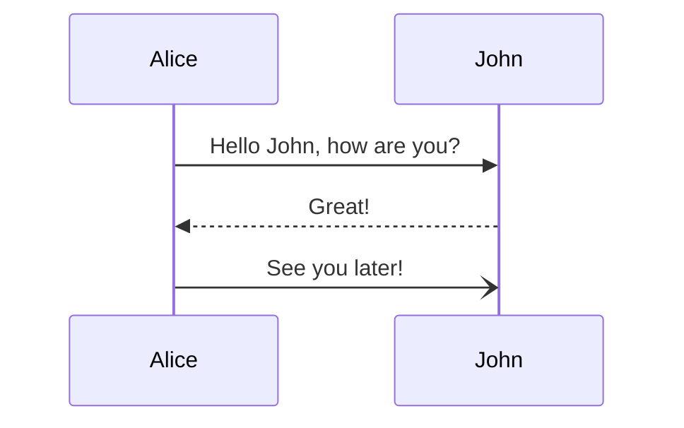

# Introduction
## Reasoning

Building a Linux device is a complex task, which requires development of multiple domain-specific services. Inter-process communication is a common task to solve in cases like this. Krossbar is developed to help implement, monitor, and manage a complex service-based linux systems.

The core concept of Krossbar is a full-features message bus. It meant to be a more convenient replacement of the common existing Linux solutions.

To rendezvois the services Krossbar provides a service bus, which uses permission-based service files to decide if services allowed to connect. Using anonimous domain sockets excludes possibility of violation of the rules.

The following diagram represent basics of the connection process:
